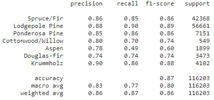

# Forest-Cover-Classification
In this project I have built a classifier using deep learing to predict the forest cover type based on cartographic variables. The dataset contains variables derived from data obtained from the US Geological Survey and USFS (United States Forest Service). These variables include qualitative variables sush as wilderness areas and soil type.

## Motivation
Goal is to predict on of the listed cover types:
  * Spruce/Fir
  * Lodgepole Pine
  * Ponderosa Pine
  * Cottonwood/Willow
  * Aspen
  * Douglas-fir
  * Krummholz

Data set is quite detailed. It contains 54 columns such as `elevation`, `slope`, `hillshades` (at different times) and multiple `soil_types`.

[Link to dataset](https://www.kaggle.com/datasets/adrianwiktorowicz/cover-data)

## Tech stack
* For builidng classifier:
  - `tensorflow`, `keras`
* Data clean, preproces, extract features and labels:
  - `pandas`
* Metrics, splitting data into train and test sets:
  - `scikit-learn`
* Plotting
  - `matplotlib`
  

## Outcomes
I got preety good performance without overfitting my model, with accuracy based on ~87% so it is fine. However I think there is more to achive with different parameters or maybe some other regularization techniques. In my case I have only used one layer with Dropout. 
Here are metrics from `scikit-learn` `classification_report`:

